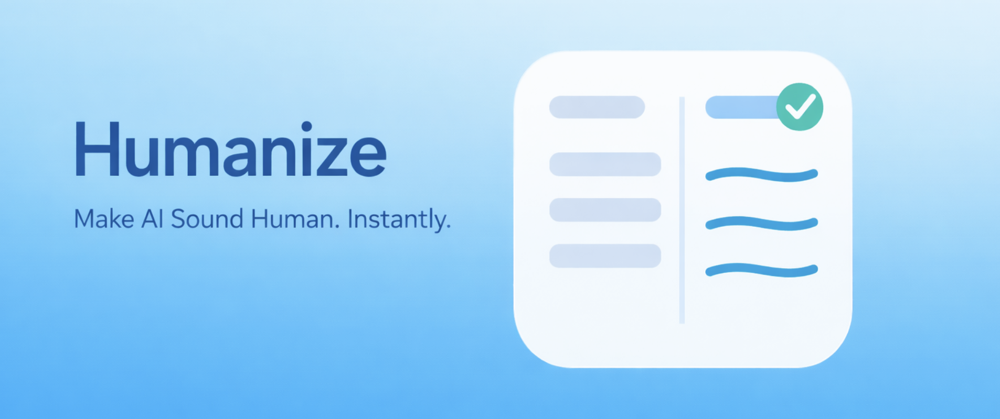
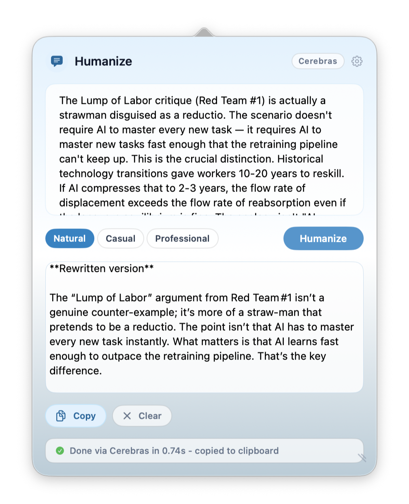
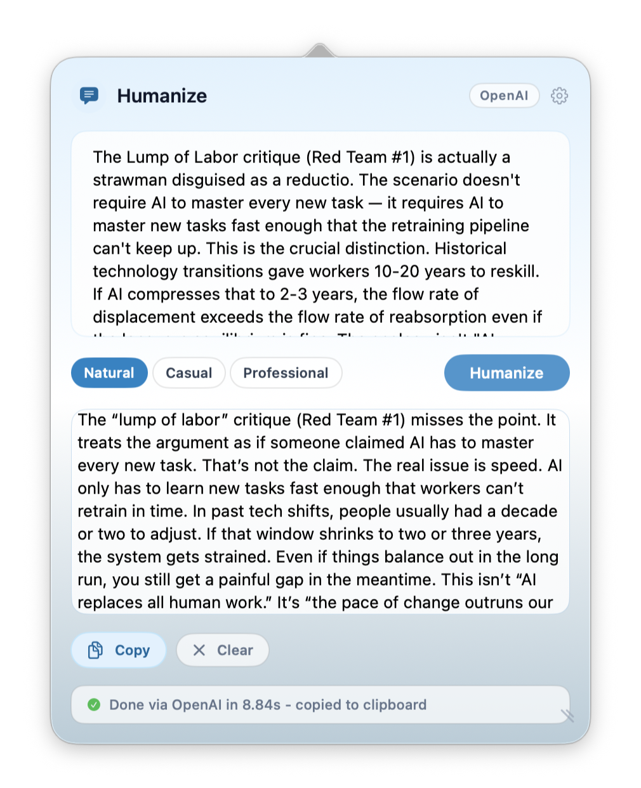
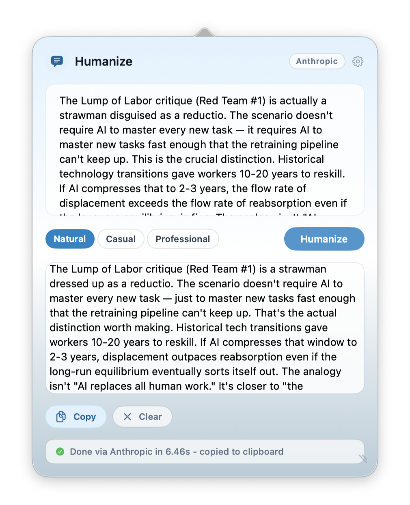

# Humanize

A cross-platform app that rewrites AI-generated text into natural, human-sounding prose. Available as a native macOS menu bar app and an iOS app. Paste text, pick a tone, and get rewritten output copied to your clipboard.

<p align="center">
  
</p>

**[Download the latest macOS release (DMG)](https://github.com/joemccann/humanize/releases/latest/download/HumanizeBar.dmg)** — Open the DMG, drag to Applications, then run:

```bash
xattr -cr /Applications/HumanizeBar.app
```

Bring your own key and select your provider. Cerebras is the default and recommended provider as it is the most affordable and provides the best results in fractions of a second.

<p align="center">
  
  
  
</p>

## Features

- **macOS**: Lives in the menu bar — always one click away
- **iOS**: Full iPhone app with the same design language
- Paste-in, humanize, copy-out workflow
- BYOK: bring your own Cerebras, OpenAI, or Anthropic API key
- Recommended default: Cerebras with automatic backup attempts to OpenAI and Anthropic
- Tone selection: natural, casual, professional
- Light, dark, and system appearance modes
- "See Details" button reveals AI analysis of what patterns were found and fixed (rendered as rich markdown)
- Built with SwiftUI, no Electron, no web views

## Requirements

- macOS 14 (Sonoma) or later / iOS 17 or later
- Swift 6.0+
- At least one API key (Cerebras recommended)

## Build

### macOS (CLI)

```bash
swift build
```

### iOS (Xcode)

First, create the iOS Xcode project (one-time setup):

```bash
bash scripts/create-ios-project.sh
```

Then open `HumanizeMobile/HumanizeMobile.xcodeproj` in Xcode and build the `HumanizeMobile` scheme for an iOS simulator or device.

## Test

### macOS + Shared (CLI)

```bash
swift test
```

163 tests across 18 suites covering types, settings persistence, API service (request building, response parsing, error handling), fallback behavior, whitespace normalization, structured response parsing, multi-provider integration, and UI view instantiation.

### iOS (Xcode)

Build and run the `HumanizeMobileTests` scheme in Xcode targeting an iOS simulator.

41 tests across 7 suites covering app launch, theme tokens, view instantiation, settings, clipboard, ViewModel (analysis state, clear, error mapping), and mobile flow integration.

**Total: 204 tests across 25 suites.**

## Generate app icon assets

```bash
bash scripts/generate-app-icons.sh
```

This generates icon assets from `shared/Resources/AppIcon-1024.png` (or pass `--source <path>`):

- `shared/Resources/AppIcon-1024.png`
- `shared/Resources/AppIcon.iconset/*`
- `shared/Resources/AppIcon.icns`

## Create .app bundle

```bash
bash scripts/build-app.sh
```

The signed app bundle is written to `HumanizeBar.app` in the project root and includes `AppIcon.icns`.

## Publish for production

`scripts/publish-app.sh` is the production packaging flow. It performs:

- Release build
- Developer ID signing (`codesign --options runtime --timestamp`)
- Notarization + stapling (unless explicitly skipped)
- Installation of the final app to `/Applications/HumanizeBar.app`

### Required environment variables

- `PUBLISH_SIGNING_IDENTITY` (Developer ID Application certificate)
- `PUBLISH_NOTARY_PROFILE` (`xcrun notarytool` keychain profile)

### Publish command

```bash
PUBLISH_SIGNING_IDENTITY="Developer ID Application: Your Name (TEAMID)" \
PUBLISH_NOTARY_PROFILE="AC_NOTARY_PROFILE" \
bash scripts/publish-app.sh
```

### Optional: skip notarization (internal use only)

```bash
bash scripts/publish-app.sh \
  --signing-identity "Developer ID Application: Your Name (TEAMID)" \
  --skip-notarization
```

## Install on iPhone

### Via USB cable (Xcode — free Apple ID)

1. **Add your Apple ID to Xcode**: Xcode > Settings > Accounts > add your Apple ID. Xcode creates a "Personal Team" provisioning profile automatically.

2. **Enable Developer Mode on iPhone**: Settings > Privacy & Security > Developer Mode > toggle on. The device restarts; confirm the alert after reboot.

3. **Connect your iPhone** via USB. Select it from the Xcode run destination dropdown. Tap "Trust This Computer" on the device if prompted.

4. **Configure signing**: Select the `HumanizeMobile` target > Signing & Capabilities. Check "Automatically manage signing" and set Team to your Personal Team. If the bundle identifier conflicts, change it to something unique (e.g., `com.yourname.humanize`).

5. **Build and run**: Press `Cmd+R`. Xcode builds, installs, and launches the app.

6. **Trust the developer profile**: The first launch shows an "Untrusted Developer" dialog. On the iPhone go to Settings > General > VPN & Device Management, tap your Apple ID, tap Trust. Then relaunch the app.

> **Free provisioning limits**: Apps expire after 7 days and must be re-deployed. Max 3 apps simultaneously. Some entitlements (push notifications, iCloud) are unavailable.

### Via TestFlight (beta distribution)

Requires an [Apple Developer Program](https://developer.apple.com) membership ($99/year).

1. **Create an App Store Connect record**: At [appstoreconnect.apple.com](https://appstoreconnect.apple.com), click My Apps > "+" > New App. Set the bundle ID to match your Xcode project, fill in the name and SKU.

2. **Configure distribution signing**: In Xcode, set the `HumanizeMobile` target's Team to your paid Developer Program team. Ensure the bundle identifier matches App Store Connect.

3. **Archive**: Select "Any iOS Device (arm64)" as destination. Product > Archive.

4. **Upload**: In the Organizer window, select the archive > Distribute App > App Store Connect > Upload. Processing takes 5–30 minutes.

5. **Invite testers**: In App Store Connect > TestFlight tab:
   - **Internal** (up to 100 team members): Available immediately once processed.
   - **External** (up to 10,000 testers): Create a group, add the build, submit for a brief Apple review. Add testers by email — they install via the TestFlight app.

6. **Update**: Increment the build number, archive, and upload again. Internal testers get access immediately; external builds are auto-approved after the first review.

## Configuration

All settings are managed in-app via the settings panel:

- **Provider** — Cerebras (recommended), OpenAI, or Anthropic
- **API Keys** — stored in UserDefaults per provider
- **Cerebras fallback** — tries `zai-glm-4.7`, then `gpt-oss-120b`, then OpenAI, then Anthropic; other providers stay strict
- **Tone** — natural, casual, or professional
- **Appearance** — system, light, or dark

### Provider Models

Current default models by provider (source of truth: `AIProvider.defaultModel` in `shared/Sources/Types.swift`):

- **Cerebras** — `zai-glm-4.7` (fallback: `gpt-oss-120b`)
- **OpenAI** — `gpt-5.2-chat-latest`
- **Anthropic** — `claude-sonnet-4-6`

At request time, OpenAI and Anthropic model lists are queried with your API key and the newest compatible available model is selected automatically. If a selected model is unavailable, the app retries with a compatibility fallback model for that provider.

## Architecture

```
shared/
  Sources/                               # HumanizeShared (cross-platform library)
  ├── Types.swift                        # HumanizeTone, AIProvider, HumanizeResult, HumanizeError
  ├── AppAppearance.swift                # AppAppearance + #if os(macOS) resolvedColorScheme
  ├── HTTPClient.swift                   # Async networking protocol
  ├── SystemPrompt.swift                 # Embedded rewrite prompt
  ├── HumanizeAPIService.swift           # Provider request orchestration
  ├── SettingsStore.swift                # @Observable persistence via UserDefaults
  └── TextUtilities.swift               # normalizeInputWhitespace, formatLatencySeconds, parseHumanizeResponse, formatAnalysisForDisplay
  Tests/
  ├── HumanizeSharedTests/              # Shared library tests (CLI)
  └── HumanizeTestSupport/              # MockHTTPClient shared test infrastructure
  Resources/                             # AppIcon-1024.png, .iconset/, .icns

macos/
  Sources/                               # HumanizeBar (macOS menu bar app)
  ├── HumanizeBarApp.swift               # App entry point (menu bar only)
  ├── AppDelegate.swift                  # Status item + popover lifecycle
  ├── PopoverView.swift                  # Main UI + Theme
  ├── PopoverSizing.swift                # NSSize constants
  └── SettingsView.swift                 # macOS settings window
  Tests/                                 # HumanizeBarTests (macOS-only tests)
  Info.plist                             # macOS bundle config

ios/
  Sources/                               # HumanizeMobile (iOS app)
  ├── HumanizeMobileApp.swift            # iOS @main entry
  ├── ContentView.swift                  # NavigationStack root
  ├── HumanizeView.swift                 # iOS main UI + analysis sheet
  ├── HumanizeViewModel.swift            # @Observable MVVM view model
  ├── MobileSettingsView.swift           # iOS settings sheet
  ├── MobileTheme.swift                  # UIColor adaptive colors
  ├── Clipboard.swift                    # UIPasteboard wrapper
  └── Assets.xcassets/                   # iOS app icon (1024x1024 universal)
  Tests/                                 # HumanizeMobileTests (iOS tests, Xcode)
```

Operational scripts:

- `scripts/generate-app-icons.sh` — build `.iconset`/`.icns` from source PNG
- `scripts/build-app.sh` — local signed app bundle build
- `scripts/publish-app.sh` — production package/sign/notarize/install flow

## License

MIT
